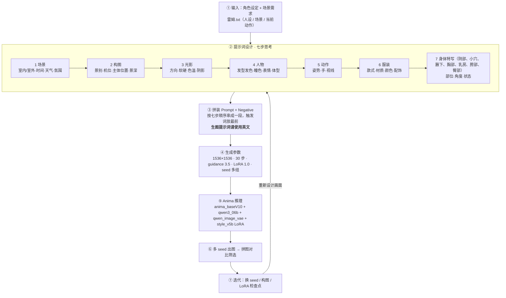

# Anima 出图流程 · 提示词框架七步（Mermaid 版。生图提示词请使用英文）

```mermaid
flowchart TD
    A["① 输入：角色设定 + 场景需求<br/>雷姆.txt（人设 / 场景 / 当前动作）"] --> B
    subgraph B["② 提示词设计 · 七步思考"]
        direction LR
        B1["1 场景<br/>室内/室外·时间·天气·氛围"] --> B2["2 构图<br/>景别·机位·主体位置·景深"]
        B2 --> B3["3 光影<br/>方向·软硬·色温·阴影"]
        B3 --> B4["4 人物<br/>发型发色·瞳色·表情·体型"]
        B4 --> B5["5 动作<br/>姿势·手·视线"]
        B5 --> B6["6 服装<br/>款式·材质·颜色·配饰"]
        B6 --> B7["7 身体特写（阴部、小穴、腋下、胸部、乳房、胯部、臀部）<br/>部位·角度·状态"]
    end
    B --> C["③ 拼装 Prompt + Negative<br/>按七步顺序串成一段，触发词放最前<br/><b>生图提示词请使用英文</b>"]
    C --> D["④ 生成参数<br/>1536×1536 · 30 步 · guidance 3.5 · LoRA 1.0 · seed 多组"]
    D --> E["⑤ Anima 推理<br/>anima_baseV10 + qwen3_06b + qwen_image_vae + style_v5b LoRA"]
    E --> F["⑥ 多 seed 出图 → 拼图对比筛选"]
    F --> G["⑦ 迭代：换 seed / 构图 / LoRA 检查点"]
    G -->|重新设计画面| B
```

>
> 产物：`outputs\雷姆_浴室\seed*.png` + `_对比图.png`；生成记录 `生成记录.md`；复现脚本 `jobs\gen_rem_bath.py`。
